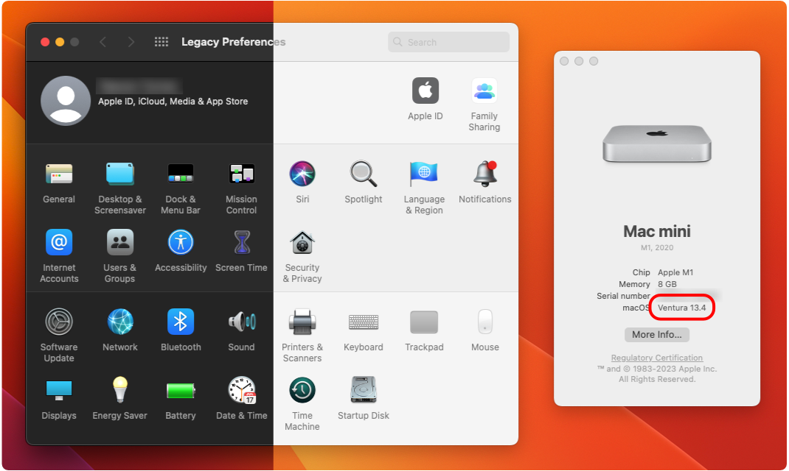

    <h1 align="left" style="">Legacy Preferences</h1>
    

    Work-In-Progress recreation of the classic System Preferences to make Ventura not suck. Made with the help of Gemini.
    YES IM FINALLY MAKING THIS PROJECT RELEVANT AGAIN! YAY! :D
         
    

 

    
    
    
    

___

## Project overview
### What does it do?
There are many ways to attempt to restoration of the classic System Preferences in Ventura; but all those methods are pretty jank, require too much work, or just won't work. For example:
- Port an old app bundle on System Preferences from an older OS install
- Use the NSPreferencePane API to wrap the old `.prefPanes` (those also must be ported form an older OS) 

In order to truly return the ways of old, someone must take it upon themselves to recreate the old. This is a long work in progress, the end goal being replication of classic System Preferences; excluding panes that require interfacing with your Apple ID due to limitations. Check out the [completion checklist](#completion-checklist) if you care.

### Why this?
Because some of us miss the ways of old (see new [System Settings](https://9to5mac.com/2022/06/06/macos-13-ventura-system-settings-first-look/)).

## Installation
I will slowly make Releases with more and more feature. **Currently, only the General (Appearance) settings is partially working (almost done)**

## Completion Checklist
### Features
- [ ] Spotlight Search
- [ ] Localization
- [X] Basic Navigation
- [X] Sort panes
- [X] Hide panes
- [X] Menu bar stuff
- [ ] Customize depending on Mac model
- [ ] Jump to pane from dock
- [ ] Port all panes from Monterey (required sadly)
- [ ] 3rd party panes
### Panes
| Status | Pane(s)
| ---- | ---- |
| ☑️ Finished | General / Appearance (partial) |
| 🛠️ WIP | All the rest... |
| ‼️ :hammer_and_wrench: Very Complicated to finish due to Apple | Apple ID, Family Sharing, Screen Time, Time Machine, Startup Disk,  Software Update, Some 3rd party panes |
---

**Note:** Unsupported panes (excluding those there for completion) are disabled for now.

## Contribution
If anyone wishes to contribute towards pane stuff or finds some problems, feel free to open an issue or PR. I will respond and evaluate propositions as quick as possible.

## Preferences panes
### Unported
- Accounts.prefPane
- AppleIDPrefPane.prefPane (Maybe restart from scratch)
- Battery.prefPane
- Bluetooth.prefPane
- ClassKitPreferencePane.prefPane
- ClassroomSettings.prefPane
- DateAndTime.prefPane
- DesktopScreenEffectsPref.prefPane
- DigiHubDiscs.prefPane
- Displays.prefPane
- Dock.prefPane
- EnergySaverPref.prefPane
- Expose.prefPane
- Extensions.prefPane
- FamilySharingPrefPane.prefPane
- FibreChannel.prefPane
- InternetAccounts.prefPane
- Keyboard.prefPane
- Localization.prefPane
- Mouse.prefPane
- Network.prefPane
- Notifications.prefPane
- Passwords.prefPane (Unusable since macOS Sequoia because Apple made a dedicated app for it)
- PrintAndScan.prefPane
- Profiles.prefPane
- ScreenTime.prefPane (Maybe restart from scratch)
- Security.prefPane
- SharingPref.prefPane
- SoftwareUpdate.prefPane (Maybe restart from scratch)
- Sound.prefPane
- Speech.prefPane
- Spotlight.prefPane
- StartupDisk.prefPane
- TimeMachine.prefPane
- TouchID.prefPane
- Trackpad.prefPane
- UniversalAccessPref.prefPane
- Wallet.prefPane
### Ported
- Appearance.prefPane (Partial)

## ⚠️ Disclaimer
The app icon used by Legacy Preferences was designed by Apple; this icon belongs to the System Preferences/System Settings app by default on macOS. I do not own it.

Also, if I mess up implementing some preference and wigs out, I hold not responsibility for bricking your machine or nuking your filesystem.

No one sue me please.

